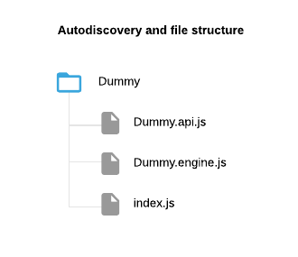

# Autodiscovery

The autodiscovery feature aims to help developers cut down in repetition and facilitate refactoring.  

_Using the autodiscovery feature is not mandatory but is highly recommended_  

During the initialization phase, an autodiscovery enabled engine will:

  1. Parse every file under it's directory;
  2. Compile every registered [actions](./Guide-Action);
  3. Compile every [extendable actions](./Guide-Extendable-Action);
  4. Compile every resource structures (schemas);
  5. Register local action queue name;
  6. Store every local action configurations;
  7. Store every local extendable action configurations;
  8. Store every local resource structure (schemas).
  
All of these steps could be done manually but would be very verbose.  

## JSDoc and autodiscovery

The autodiscovery feature is based and extends the [JSDoc tags](http://usejsdoc.org).  
A normal JSDoc comment block describes a function's arguments and return.

```javascript
/**
 * Creates a dummy.
 * 
 * @argument {Object} dummyAttributes
 *
 * @returns {Promise<{ dummy: Dummy }>}
 */
 function createDummy (dummyAttributes) {
   // Do something with the attributes...
   return Promise.resolve({ dummy: dummyAttributes });
 }
```
_The JSDoc comment block describes that the function expects one argument named `dummyAttributes` which should be of 
type `object` and it will return a promise containing an object with a property `dummy`._  

Autodiscovery extends this vocabulary by introducing the `@Nucleus` tag.  

`@Nucleus <TagName> <TagArgument>...`  

### Annotating an action

Using the extended JSDoc vocabulary, simple actions can be easily documented and prepared for autodiscovery.

| Tag name                     | Tag arguments     | Description                                                                                                | Example                                                         |
|------------------------------|-------------------|------------------------------------------------------------------------------------------------------------|-----------------------------------------------------------------|
| `ActionName`                 | `{String}`        | The action name of the following function.                                                                 | `@Nucleus ActionName CreateDummy`                               |
| `EventName`                  | `{String}`        | The event name that will be triggered after the action's execution.                                        | `@Nucleus EventName DummyCreated`                               |
| `ActionAlternativeSignature` | `{String}...`     | An alternative signature for the action. [See documentation](./Guide-Action#action-alternative-signature). | `@Nucleus ActionAlternativeSignature dummyName dummyAttributes` |

```javascript
/**
 * Creates a dummy.
 * 
 * @Nucleus ActionName CreateDummy
 * @Nucleus EventName DummyCreated
 * 
 * @argument {Object} dummyAttributes
 *
 * @returns {Promise<{ dummy: Dummy }>}
 */
 function createDummy (dummyAttributes) {
   // Do something with the attributes...
   return Promise.resolve({ dummy: dummyAttributes });
 }
```

If the function is not part of the file, document the action accordingly.

```javascript
/**
 * Creates a dummy.
 * 
 * @Nucleus ActionName CreateDummy
 * @Nucleus EventName DummyCreated
 * 
 * @argument {Object} dummyAttributes
 *
 * @returns {Promise<{ dummy: Dummy }>}
 * 
 * @memberOf DummyAPI
 * @function createDummy
 */
```

### Annotating a resource structure (schema)

Using the extended JSDoc vocabulary, resource structure can be easily documented and prepared for autodiscovery.

| Tag name          | Tag arguments | Description            | Example                           |
|-------------------|---------------|------------------------|-----------------------------------|
| `ResourceAPIName` | `{String}`    | The resource API name. | `@Nucleus ActionName CreateDummy` |

```javascript
/**
 * @Nucleus ResourceAPIName DummyAPI
 *
 * @typedef {Object} Dummy
 * @property {String|Object} [description]
 * @property {String|Object} name
 * @property {String|Object} [title]
 */
```

## Enabling autodiscovery

When creating an engine you can enable autodiscovery to be executed during the initialization phase by setting the
option `automaticallyAutodiscover` to `true`.

```javascript
// Dummy/Dummy.engine.js
"use strict";

const { NucleusEngine } = require('idex.nucleus');

class DummyEngine extends NucleusEngine {
  constructor(options = {}) {
    const engineName = 'Dummy';
    
    super(engineName, {
      // Defaults to `false`
      automaticallyAutodiscover: true
    });
  }
}
```

Alternatively, you can execute the autodiscovery manually at any time.

```javascript
const $engine = new DummyEngine();

$engine.autodiscover();
```

## File structure

Even if files can be nested in directory, this is the preferred file structure for autodiscovery:  



  * The directory should have the same name as the engine;
  * The engine file should have the suffix `.engine.js`;
  * The API files should have the suffix `.api.js`;
  * There should be an `index.js` file to initialize the engine and log any uncaught error.
  
```javascript
// Dummy/index.js
"use strict";

const DummyEngine = require("./Dummy.engine");

const $engine = new DummyEngine();

if (require.main === module) {
  $engine.catch(console.error);
} else module.exports = $engine;

process.on("error", console.error.bind(console));

process.on("warning", console.error.bind(console));

process.on("uncaughtException", console.error.bind(console));

process.on("unhandledRejection", console.error.bind(console));
```

In case of a more complex structure, the engine directory path can be specified in the class constructor of the engine
as `engineDirectoryPath`.

```javascript
// Dummy/Dummy.engine.js
const { NucleusEngine } = require('idex.nucleus');

class DummyEngine extends NucleusEngine {
  constructor(options = {}) {
    const engineName = 'Dummy';
    
    super(engineName, {
      // Defaults to `false`
      automaticallyAutodiscover: true
    });
    
    this.engineDirectoryPath = __dirname;
  }
}
```