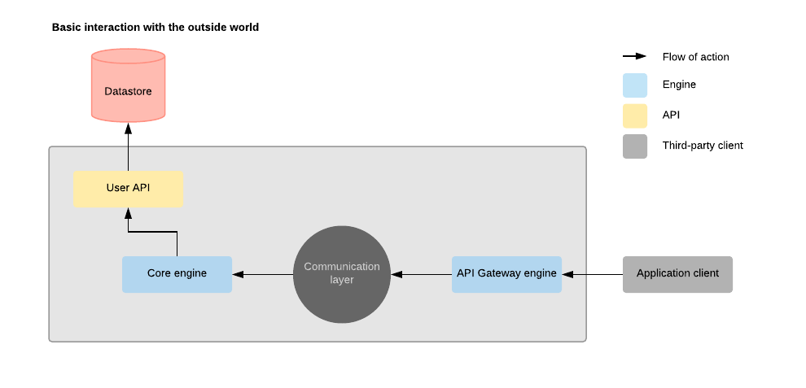
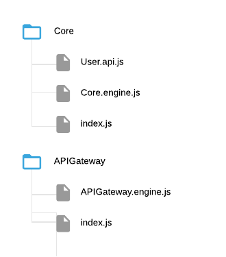

# Create a basic API with public Gateway

Once you learned how to create [your first engine](./Tutorial-Create-a-basic-engine), you probably wondered: 
"Okay, but what's next?".
Nucleus implements a communication layer that allows for a decentralized and distributed architecture.  
The engine is tasked with interacting with the communication layer while APIs can be used to wrap a third party client.  



_Taking the image above_  

  1. A request comes in through the API Gateway engine that manages a HTTP server;
  2. The API Gateway engine processes every requests and normalize them for the Nucleus communication layer;
  3. The requests are queued as [Action](./Guide-Action);
  4. Engines routinely execute pending actions using local action configuration;
  5. Once an action is correctly executed, it is marked as "Completed" allowing the origin engine to relay the answer;
  6. If an action fails, it will similarly mark it as "Failed" and pass it to the origin engine to relay the error;
  
Let's build such a system!

To convey that the engines can be distributed on different, thread, environment, computer, city or even country, we will
separate them into different directories: the Core's and the API Gateway's.



The Core's engine will be very similar to the one we created before, but two options will be set: 
`automaticallyAutodiscover` and `automaticallyRetrievePendingActions`.  
This will tell the engine to use [autodiscovery](./Guide-Autodiscovery) and to automatically retrieve pending actions.

```javascript
// Core/Core.engine.js

"use strict";

const { NucleusEngine } = require('@idex/nucleus.core');

class CoreEngine extends NucleusEngine {

  constructor () {

    super('Core', {
      automaticallyAutodiscover: true,
      automaticallyRetrievePendingActions: true
    });
  }

}

module.exports = CoreEngine;
```

For the User's API, we will create a very simple persistent storage API.  
An API is nothing more than a bunch of overly documented functions... Every API functions *must* return a promise. If
you must handle errors, make sure to still reject the promise.  
Note that an API function can't have access to the communication layer but will be provided a [datastore connection](./Datastore.nucleus).  
For more details on this, refer to the [Action guide](./Guide-Action).

```javascript
// Core/User.api.js

"use strict";

const uuid = require('uuid');

/**
 * Creates an user.
 *
 * @Nucleus ActionName CreateUser
 *
 * @argument {Object} userAttributes
 *
 * @returns {Promise<{ user: User }>}
 */
function createUser (userAttributes) {
  const { $datastore } = this;
  if (!('ID' in userAttributes)) userAttributes.ID = uuid.v4();

  return $datastore.createItem(`User:${userAttributes.ID}`, userAttributes)
    .return({ user: userAttributes });
}

/**
 * Removes an user given its ID.
 *
 * @Nucleus ActionName RemoveUserByID
 *
 * @argument {String} userID
 *
 * @returns {Promise<{ userID: String }>}
 */
function removeUserByID (userID) {
  const { $datastore } = this;

  return $datastore.removeItemByName(`User:${userID}`)
    .return({ userID });
}

/**
 * Retrieves an user given its ID.
 *
 * @Nucleus ActionName RetrieveUserByID
 *
 * @argument {String} userID
 *
 * @returns {Promise<{ user: User }>}
 */
function retrieveUserByID (userID) {
  const { $datastore } = this;

  return $datastore.retrieveItemByName(`User:${userID}`)
    .then(user => ({ user }));
}

/**
 * Updates an user given its ID.
 *
 * @Nucleus ActionName UpdateUserByID
 *
 * @argument {String} userID
 * @argument {Object} userAttributes
 *
 * @returns {Promise<{ user: User }>}
 */
function updateUserByID (userID, userAttributes) {
  const { $datastore } = this;
  
  userAttributes.ID = userID;

  return $datastore.createItem(`User:${userID}`, userAttributes)
    .return({ user: userAttributes });
}

// Core/User.api.js
module.exports = {
  createUser,
  removeUserByID,
  retrieveUserByID,
  updateUserByID
};
```

On the other side, we can implement a quick HTTP server using express. 

```javascript
// APIGateway/APIGateway.engine.js

"use strict";

const bodyParser = require('body-parser');
const express = require('express');
const http = require('http');
const uuid = require('uuid');

const { NucleusPublisherEngine } = require('@idex/nucleus.core');

const HTTP_PORT = 3000;

class APIGatewayEngine extends NucleusPublisherEngine {

  constructor () {
    super('APIGateway');

    this.$$application  = express();
    this.$$httpServer = http.createServer(this.$$application);

    // Once the engine is initialized...
    this.$$promise = this.$$promise
      .then(() => {

        return new Promise((resolve) => {
          // HTTP server listens on the given port;
          this.$$httpServer.listen(HTTP_PORT, resolve);
        });
      })
      .then(() => {
        this.$logger.info(`HTTP server is listening on port ${HTTP_PORT}.`);
      })
      .then(this.registerRESTEndpoints.bind(this));
  }

  registerRESTEndpoints () {
    // Match the verb/path to the correct action to execute.
    // By example, running this command will create a user.
    // $ localhost:3000/user -X POST -d "{\"userAttributes\":{\"name\":\"John Doe\"}}"
    const routeList = [
      [ 'POST', '/user', 'CreateUser' ],
      [ 'DELETE', '/user/:userID', 'RemoveUserByID' ],
      [ 'GET', '/user/:userID', 'RetrieveUserByID' ],
      [ 'PATCH', '/user/:userID', 'UpdateUserByID' ]
    ];

    this.$$application.use(bodyParser.json());
    this.$$application.use(bodyParser.urlencoded({ extended: true }));

    this.$$application.use((request, response, next) => {

      response.header("Access-Control-Allow-Origin", request.headers.origin);
      response.header("Access-Control-Allow-Methods", "GET,PUT,POST,DELETE");
      response.header("Access-Control-Allow-Headers", "X-Requested-With, X-HTTP-Method-Override, Content-Type, Authorization, Accept");
      response.header("Access-Control-Allow-Credentials", "true");
      response.header("X-Powered-By", "Nucleus");


      if (request.method === 'OPTIONS') {
        response.header("Access-Control-Max-Age", 1000 * 60 * 10);
        return response.status(204).end();
      }
      next();
    });

    routeList
      .forEach(([ endpointVerb, endpointPath, actionName ]) => {
        this.$$application[endpointVerb.toLowerCase()](endpointPath, async (request, response) => {
          try {
            // Gather all available data as the action message.
            const actionMessage = Object.assign({}, request.body, request.params, request.query);
            const actionResponse = await this.publishActionByNameAndHandleResponse(actionName, actionMessage, uuid.v4());

            response.status(200).send(actionResponse).end();
          } catch (error) {

            response.status(500).send(error).end();
          }
        });
      });
  }

}

module.exports = APIGatewayEngine;
```

At this point, all you have left to do is to initialize you engines...

```javascript
// Core/index.js

"use strict";

const CoreEngine = require("./Core.engine");

const $coreEngine = new CoreEngine();

if (require.main === module) {
  $coreEngine.catch(console.error);
} else module.exports = $coreEngine;
```

Assuming that Redis is [running correctly](./Home), in two different terminal, run your new engines...

```bash
$ node Core/
> The Core engine has successfully initialized.
```

```bash
$ node APIGateway/
> HTTP server is listening on port 3000.
```

Now you are ready to test your new API:  

**Create a user**
```bash
$ curl localhost:3000/user -X POST -d "{\"userAttributes\":{\"name\":\"John Doe\"}}"
> {"user":{"ID":"dbf7ff2f-039d-4303-9753-990a24dddb2b","name":"John Doe"}}
```

**Retrieve the user**
```bash
$ curl localhost:3000/user/dbf7ff2f-039d-4303-9753-990a24dddb2b -X GET
> {"user":{"ID":"dbf7ff2f-039d-4303-9753-990a24dddb2b","name":"John Doe"}}
```

**Update the user**
```bash
$ curl localhost:3000/user/dbf7ff2f-039d-4303-9753-990a24dddb2b -X PATCH "{\"userAttributes\":{\"name\":\"Jane Doe\"}}"
> {"user":{"ID":"dbf7ff2f-039d-4303-9753-990a24dddb2b","name":"Jane Doe"}}
```

**Delete the user**
```bash
$ curl localhost:3000/user/dbf7ff2f-039d-4303-9753-990a24dddb2b -X DELETE
> {"userID":"dbf7ff2f-039d-4303-9753-990a24dddb2b"}
```

But yeah, that would become a bit repetitive as you add more resources... Nucleus comes bundled with tools to help with
[common persistent storage API](./Tutorial-Create-a-persistent-storage-API) requirements.